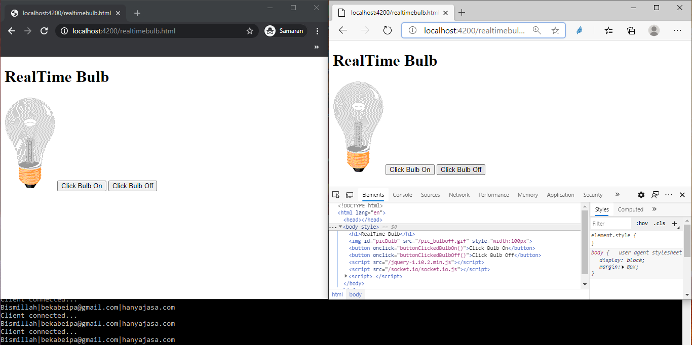
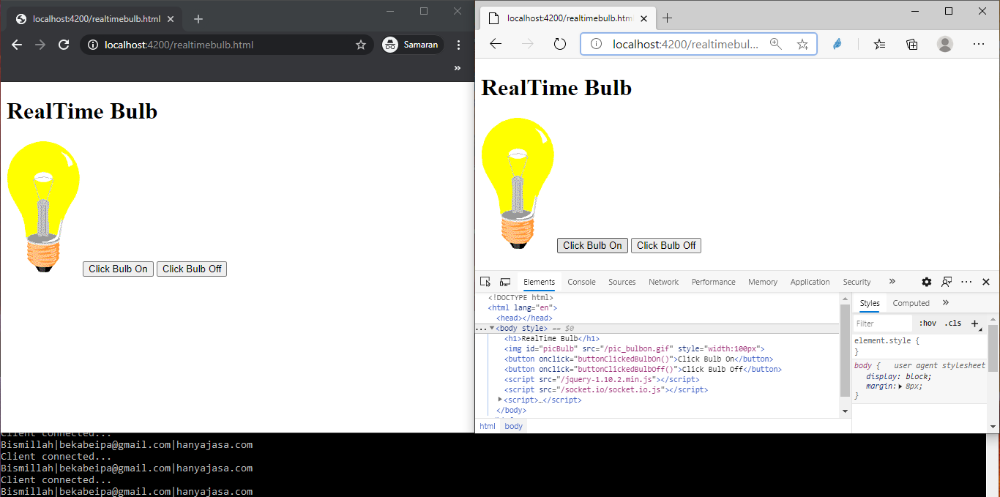

# RealTime_Bulb_NodeJS

echo "# RealTime_Bulb_NodeJS" >> README.md

git init

git add README.md

git commit -m "first commit"

git branch -M master

git remote add origin https://github.com/ryanbekabe/RealTime_Bulb_NodeJS.git

git push -u origin master

____

git remote add origin https://github.com/ryanbekabe/RealTime_Bulb_NodeJS.git

git branch -M master

git push -u origin master

____

npm --version: 6.14.4

nodejs --version: v10.19.0
